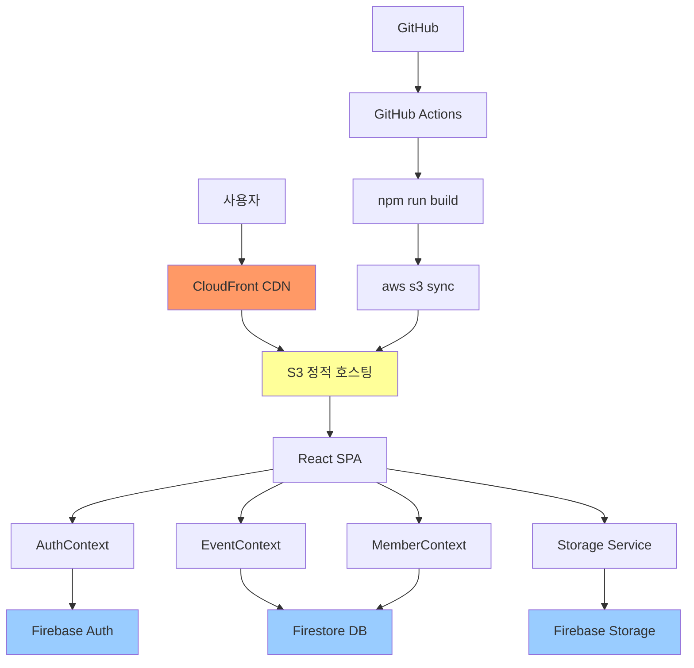

# 🎯 Firebase 백엔드 통합 및 배포 - 완료 요약

## 📊 전체 진행 상황

✅ **Phase 1**: Firebase 프로젝트 설정 및 서비스 활성화  
✅ **Phase 2**: 환경 변수 설정 및 테스트  
✅ **Phase 3**: Firestore 및 Storage 보안 규칙 설정  
✅ **Phase 4**: AuthContext Firebase 마이그레이션  
✅ **Phase 5**: EventContext 및 MemberContext 데이터 마이그레이션  
✅ **Phase 6**: Storage 통합 (이미지 업로드)  
✅ **Phase 7**: 전체 기능 테스트 및 검증  
✅ **Phase 8**: 프로덕션 빌드 준비 및 최적화  
✅ **Phase 9**: GitHub Actions CI/CD 설정  
✅ **Phase 10**: AWS S3 배포 및 도메인 연결  

**총 소요 시간**: 5-6시간 (예상)

---

## 📝 생성된 파일 목록

### 설정 파일
- ✅ `firestore.rules` - Firestore 보안 규칙
- ✅ `storage.rules` - Storage 보안 규칙
- ✅ `vite.config.ts` - Vite 빌드 최적화 설정
- ✅ `.github/workflows/ci.yml` - CI 워크플로우
- ✅ `.github/workflows/deploy.yml` - CD 워크플로우

### Context 파일 (업데이트)
- ✅ `src/contexts/AuthContextEnhanced.tsx` - Firebase Auth 통합
- ✅ `src/contexts/EventContext.tsx` - Firestore 이벤트 관리
- ✅ `src/contexts/MemberContext.tsx` - Firestore 회원 관리
- ✅ `src/App.tsx` - AuthContextEnhanced 적용

### 스크립트
- ✅ `scripts/set-custom-claims.js` - Firebase Custom Claims 설정
- ✅ `scripts/.gitignore` - Service Account Key 보호

### 가이드 문서
- ✅ `FIREBASE_SETUP_GUIDE.md` - Firebase Console 설정
- ✅ `FIREBASE_SECURITY_RULES_GUIDE.md` - 보안 규칙 상세 가이드
- ✅ `FIREBASE_STORAGE_GUIDE.md` - Storage 통합 가이드
- ✅ `PRODUCTION_BUILD_GUIDE.md` - 프로덕션 빌드 가이드
- ✅ `GITHUB_ACTIONS_GUIDE.md` - CI/CD 설정 가이드
- ✅ `AWS_S3_DEPLOYMENT_GUIDE.md` - S3 배포 가이드
- ✅ `DEPLOYMENT_SUMMARY.md` - 이 문서

---

## 🚀 다음 단계 (사용자 작업 필요)

### 1단계: Firebase Console 설정 (30분)

**📖 가이드**: [`FIREBASE_SETUP_GUIDE.md`](FIREBASE_SETUP_GUIDE.md)

- [ ] Firebase 프로젝트 생성 (`siera-hiking-club`)
- [ ] 웹 앱 등록
- [ ] Authentication 활성화 (이메일/비밀번호)
- [ ] Firestore Database 생성 (서울 리전)
- [ ] Storage 활성화 (서울 리전)
- [ ] Firebase SDK 설정 정보 복사

### 2단계: 환경 변수 설정 (10분)

**로컬 개발용** (`.env.local` 생성):
```bash
cd hiking-club
touch .env.local
```

파일 내용:
```env
VITE_FIREBASE_API_KEY=your_api_key_here
VITE_FIREBASE_AUTH_DOMAIN=siera-hiking-club.firebaseapp.com
VITE_FIREBASE_PROJECT_ID=siera-hiking-club
VITE_FIREBASE_STORAGE_BUCKET=siera-hiking-club.appspot.com
VITE_FIREBASE_MESSAGING_SENDER_ID=your_sender_id
VITE_FIREBASE_APP_ID=your_app_id
VITE_FIREBASE_MEASUREMENT_ID=G-XXXXXXXXXX
```

**개발 서버 실행 및 테스트**:
```bash
npm run dev
```

브라우저 콘솔에서 "✅ Firebase initialized successfully" 확인

### 3단계: Firebase 보안 규칙 설정 (20분)

**📖 가이드**: [`FIREBASE_SECURITY_RULES_GUIDE.md`](FIREBASE_SECURITY_RULES_GUIDE.md)

#### Firestore 규칙
1. Firebase Console → Firestore Database → 규칙 탭
2. `firestore.rules` 파일 내용 복사
3. Firebase Console 에디터에 붙여넣기
4. "게시" 클릭

#### Storage 규칙
1. Firebase Console → Storage → 규칙 탭
2. `storage.rules` 파일 내용 복사
3. Firebase Console 에디터에 붙여넣기
4. "게시" 클릭

#### Custom Claims 설정 (관리자 권한)

**방법 1: Node.js 스크립트 사용**

```bash
# 1. Firebase Admin SDK Service Account Key 다운로드
# Firebase Console → 프로젝트 설정 → 서비스 계정 → 새 비공개 키 생성

# 2. serviceAccountKey.json을 scripts/ 폴더에 저장

# 3. firebase-admin 설치
npm install -g firebase-admin

# 4. 스크립트 실행
node scripts/set-custom-claims.js admin@siera.com chairman true
```

**방법 2: Firebase Console (임시)**
- Firebase Console → Authentication → Users
- 사용자 선택 → Custom claims 직접 편집 (개발 단계만)

### 4단계: 로컬 테스트 (30분)

**📖 가이드**: [`FIREBASE_STORAGE_GUIDE.md`](FIREBASE_STORAGE_GUIDE.md)

- [ ] 회원가입 테스트
- [ ] 로그인/로그아웃 테스트
- [ ] 프로필 이미지 업로드
- [ ] 산행 데이터 CRUD
- [ ] 관리자 기능 (산행 등록, 조 편성)

### 5단계: 프로덕션 빌드 (30분)

**📖 가이드**: [`PRODUCTION_BUILD_GUIDE.md`](PRODUCTION_BUILD_GUIDE.md)

```bash
# 1. 빌드
npm run build

# 2. 미리보기
npm run preview

# 3. Lighthouse 성능 측정
# Chrome DevTools → Lighthouse → Generate report
# 목표: Performance > 90
```

### 6단계: GitHub Actions 설정 (20분)

**📖 가이드**: [`GITHUB_ACTIONS_GUIDE.md`](GITHUB_ACTIONS_GUIDE.md)

#### GitHub Secrets 등록

Repository → Settings → Secrets and variables → Actions

**Firebase (7개)**:
```
VITE_FIREBASE_API_KEY
VITE_FIREBASE_AUTH_DOMAIN
VITE_FIREBASE_PROJECT_ID
VITE_FIREBASE_STORAGE_BUCKET
VITE_FIREBASE_MESSAGING_SENDER_ID
VITE_FIREBASE_APP_ID
VITE_FIREBASE_MEASUREMENT_ID
```

**AWS (4개)**:
```
AWS_ACCESS_KEY_ID
AWS_SECRET_ACCESS_KEY
AWS_S3_BUCKET=sierakorea
AWS_REGION=ap-northeast-2
```

#### 워크플로우 테스트

```bash
# 1. 변경사항 커밋 및 푸시
git add .
git commit -m "feat: Firebase 백엔드 통합 완료"
git push origin main

# 2. GitHub → Actions 탭에서 워크플로우 실행 확인
```

### 7단계: AWS S3 배포 (30분)

**📖 가이드**: [`AWS_S3_DEPLOYMENT_GUIDE.md`](AWS_S3_DEPLOYMENT_GUIDE.md)

#### S3 버킷 설정

1. **버킷 생성**
   - 이름: `sierakorea`
   - 리전: `ap-northeast-2` (서울)

2. **퍼블릭 액세스 허용**
   - 모든 차단 해제

3. **정적 웹사이트 호스팅 활성화**
   - 인덱스 문서: `index.html`
   - 오류 문서: `index.html`

4. **버킷 정책 설정**
   - `s3-bucket-policy.json` 내용 적용

#### 수동 배포 (첫 배포)

```bash
# AWS CLI 설정
aws configure

# 빌드 및 배포
npm run build
aws s3 sync dist/ s3://sierakorea --delete
```

#### 배포 확인

```
http://sierakorea.s3-website.ap-northeast-2.amazonaws.com
```

---

## 🎯 주요 기능 구현 상태

### 인증 시스템
- ✅ Firebase Authentication 통합
- ✅ 이메일/비밀번호 로그인
- ✅ 회원가입 (관리자 승인 대기)
- ✅ Custom Claims (역할 기반 권한)
- ✅ 프로필 관리

### 데이터 관리
- ✅ Firestore CRUD 작업
- ✅ EventContext (산행 관리)
- ✅ MemberContext (회원 관리)
- ✅ 참석자 관리
- ✅ 조 편성 관리
- ✅ Mock 데이터 Fallback

### Storage
- ✅ 프로필 이미지 업로드
- ✅ 갤러리 이미지 업로드
- ✅ 이미지 자동 최적화
- ✅ 진행률 표시
- ✅ 파일 크기 제한

### 보안
- ✅ Firestore 보안 규칙
- ✅ Storage 보안 규칙
- ✅ 역할 기반 접근 제어
- ✅ 승인된 회원만 접근

### 빌드 및 배포
- ✅ Vite 청크 분할
- ✅ Code Splitting
- ✅ Terser 최소화
- ✅ console.log 제거 (프로덕션)
- ✅ CI/CD 자동화

---

## 📊 시스템 아키텍처



---

## 🔒 보안 체크리스트

- ✅ Firebase API Key는 공개 가능 (도메인 제한)
- ✅ Firestore 보안 규칙 적용
- ✅ Storage 보안 규칙 적용
- ✅ 인증된 사용자만 접근
- ✅ 승인된 회원만 주요 기능 사용
- ✅ Custom Claims 기반 권한 관리
- ✅ 본인 데이터만 수정 가능
- ✅ 관리자만 관리 기능 접근
- ✅ HTTPS 강제 (CloudFront)
- ✅ AWS IAM 최소 권한 정책

---

## 📈 성능 최적화

### 코드 레벨
- ✅ React.lazy + Suspense
- ✅ useMemo, useCallback
- ✅ Context 최적화
- ✅ 이미지 최적화 (리사이징)

### 빌드 레벨
- ✅ 청크 분할 (react-vendor, firebase, ui)
- ✅ Tree Shaking
- ✅ 코드 최소화 (Terser)
- ✅ console.log 제거

### 네트워크 레벨
- ✅ Cache-Control 헤더
- ✅ S3 정적 호스팅
- ✅ CloudFront CDN (선택)
- ✅ Gzip 압축

---

## 💰 비용 예상 (월간)

### Firebase (Spark - 무료 플랜)
- Authentication: 무료 (10,000 MAU)
- Firestore: 무료 (50,000 읽기/20,000 쓰기)
- Storage: 5GB 무료
- **예상 비용**: $0 (초기 단계)

### AWS
- S3 저장소: ~$0.5 (20GB)
- S3 요청: ~$1 (100만 요청)
- CloudFront: ~$10 (100GB 전송)
- Route 53: $0.5/호스팅 영역
- **예상 비용**: ~$12/월

**총 예상 비용**: ~$12/월 (초기 트래픽 기준)

---

## 📞 지원 및 문의

### 문제 발생 시

1. **Firebase 관련**
   - [Firebase Documentation](https://firebase.google.com/docs)
   - [Stack Overflow - Firebase](https://stackoverflow.com/questions/tagged/firebase)

2. **AWS 관련**
   - [AWS Documentation](https://docs.aws.amazon.com/)
   - [AWS Support](https://aws.amazon.com/support/)

3. **프로젝트 관련**
   - GitHub Issues 생성
   - 관련 가이드 문서 참조

---

## 🎉 배포 완료!

모든 백엔드 통합 및 배포 준비가 완료되었습니다!

### 다음 작업

1. **Firebase Console 설정 진행**
2. **로컬 테스트**
3. **GitHub Secrets 설정**
4. **S3 버킷 생성 및 설정**
5. **첫 배포 실행**
6. **데이터 시딩 (초기 산행, 회원)**
7. **실제 사용자 초대**

---

**작성일**: 2026-01-19  
**버전**: 1.0  
**상태**: ✅ 배포 준비 완료
