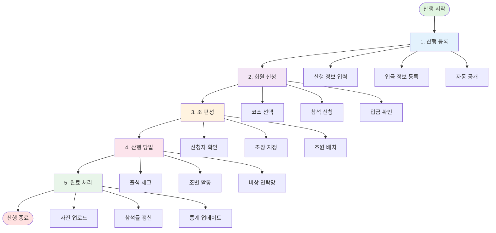
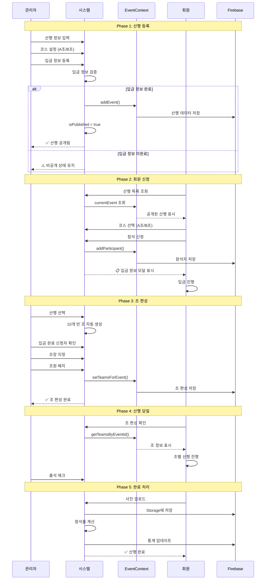
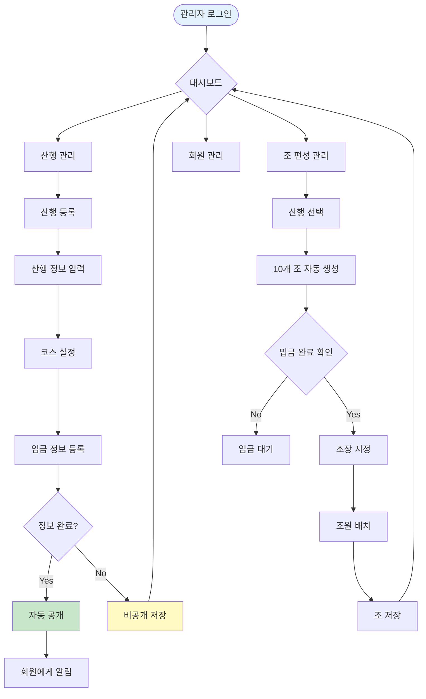
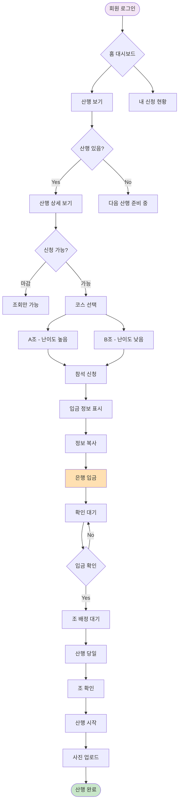
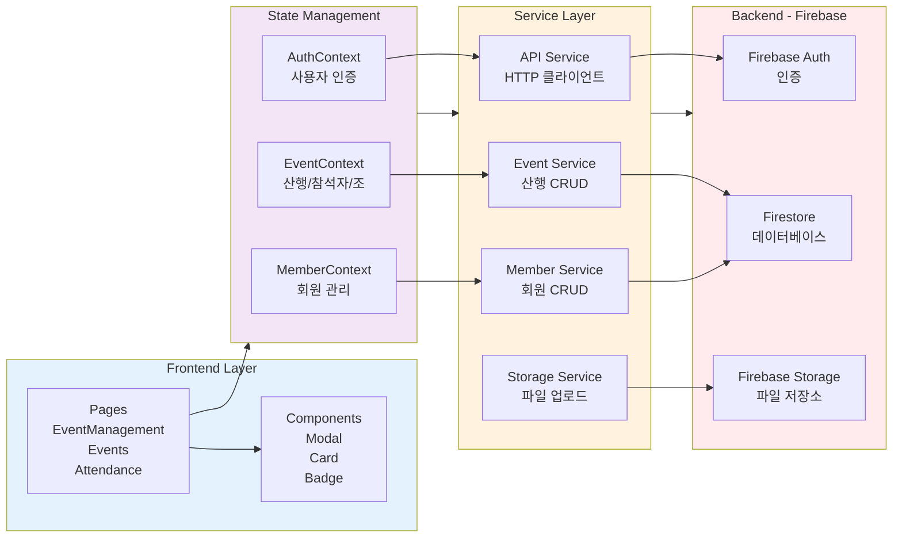
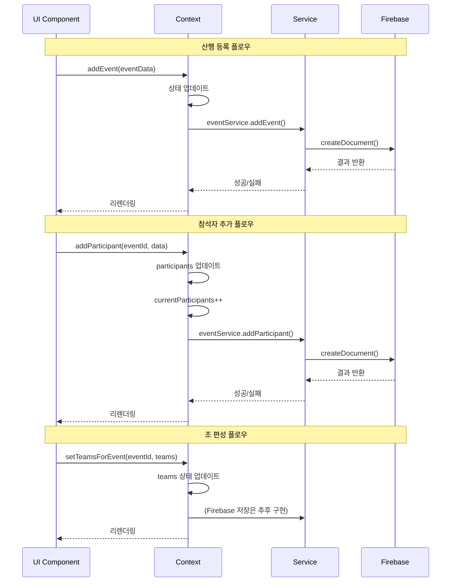
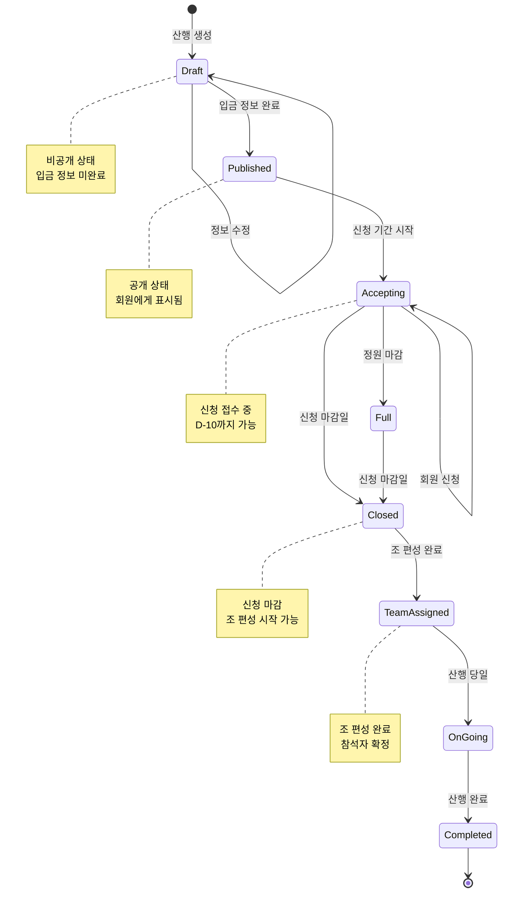
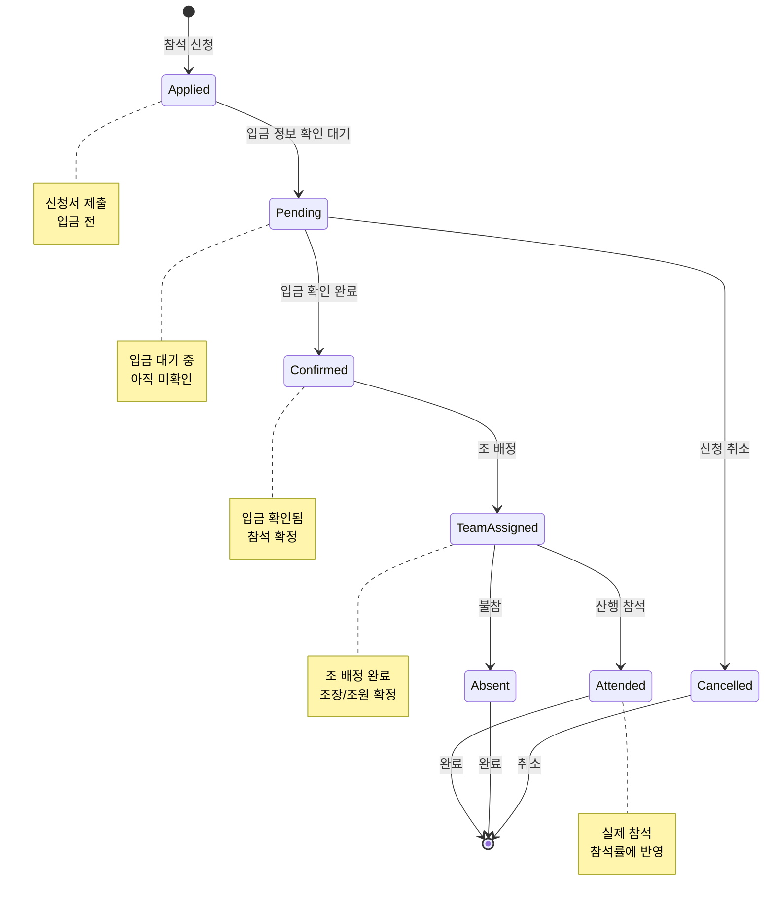

# 🏔️ 시애라 산행 시스템 플로우 다이어그램

## 📋 목차

1. [전체 시스템 개요](#전체-시스템-개요)
2. [산행 라이프사이클 플로우](#산행-라이프사이클-플로우)
3. [사용자별 상호작용 플로우](#사용자별-상호작용-플로우)
4. [데이터 아키텍처 플로우](#데이터-아키텍처-플로우)
5. [산행 상태 전이도](#산행-상태-전이도)
6. [참석자 상태 전이도](#참석자-상태-전이도)
7. [각 단계별 상세 설명](#각-단계별-상세-설명)

---

## 전체 시스템 개요

시애라 등산 클럽의 산행 관리 시스템은 **산행 등록** → **회원 신청** → **조 편성** → **산행 당일** → **완료 처리**의 5단계로 구성됩니다.



---

## 산행 라이프사이클 플로우

전체 산행의 생명주기를 시퀀스 다이어그램으로 표현합니다.



---

## 사용자별 상호작용 플로우

### 관리자 플로우



### 회원 플로우



---

## 데이터 아키텍처 플로우

시스템의 데이터가 어떻게 흐르는지 표현합니다.



### 데이터 흐름 상세



---

## 산행 상태 전이도

산행이 가질 수 있는 상태와 전이 조건을 표현합니다.



---

## 참석자 상태 전이도

참석자(Participant)의 상태 변화를 표현합니다.



---

## 각 단계별 상세 설명

### 1️⃣ 산행 등록 단계 (Admin)

**담당 컴포넌트**: `src/pages/Admin/EventManagement.tsx`

**주요 기능**:
- 산행 기본 정보 입력
  - 제목, 날짜, 장소, 산 이름, 고도
  - 난이도 (하/중하/중/중상/상)
  - 최대 인원, 설명
- 당일 동선 설정
  - 출발/정차/복귀/도착 시간 및 장소
- 산행 코스 등록
  - A조 (필수): 난이도 높음
  - B조 (선택): 난이도 낮음
  - 각 코스별 거리, 설명, 상세 일정
- 입금 정보 등록
  - 참가비, 은행명, 계좌번호, 예금주
  - 담당자 이름 및 연락처
- 비상연락처 지정
  - 운영진 중에서 선택

**데이터 흐름**:
```
EventManagement.tsx → handleSave() 
  → EventContext.addEvent() 
  → Firebase Firestore (events collection)
```

**자동 공개 로직**:
```typescript
const hasPaymentInfo = 
  paymentInfo.cost && 
  paymentInfo.bankName && 
  paymentInfo.accountNumber && 
  paymentInfo.accountHolder &&
  paymentInfo.managerName &&
  paymentInfo.managerPhone;

eventToSave.isPublished = hasPaymentInfo ? true : false;
```

**등록 제한**:
- 동시에 최대 2개 산행만 등록 가능
- 현재 월 + 다음 월 합산

---

### 2️⃣ 회원 신청 단계

**담당 컴포넌트**: `src/pages/Events.tsx`

**주요 기능**:
- 공개된 산행 조회
  - `EventContext.currentEvent` 사용
  - 특별 산행: `EventContext.specialEvent`
- 산행 상세 정보 표시
  - 날씨 정보 (당일 예보)
  - 신청 마감일 표시 (D-10)
  - 현재 신청 인원/정원
- 코스 선택 모달
  - A조 vs B조 선택
  - 각 코스의 거리, 소요시간 표시
- 참석 신청
  - 코스 선택 후 신청
  - 입금 정보 모달 자동 표시
- 입금 정보 확인
  - 은행, 계좌번호, 참가비
  - 클립보드 복사 기능
  - 담당자 연락처

**데이터 흐름**:
```
Events.tsx → handleRegister() 
  → handleCourseSelect(course) 
  → EventContext.addParticipant(eventId, participant)
  → Firebase Firestore (participants collection)
```

**신청 제한**:
- 신청 마감일: 출발일 10일 전
- 정원 초과 시 신청 불가
- 로그인 필수

---

### 3️⃣ 조 편성 단계 (Admin)

**담당 컴포넌트**: `src/pages/Admin/EventManagement.tsx` (조 편성 탭)

**주요 기능**:
- 산행 선택
  - 등록된 산행 목록에서 선택
- 자동 조 생성
  - 산행 선택 시 10개 빈 조 자동 생성
  - 1조~10조 미리 구성
- 신청자 확인
  - 입금 완료된 신청자만 표시
  - 이미 배정된 회원 제외
- 조장 지정
  - 조별로 1명의 조장 필수
  - 조장 변경 시 이전 조장은 조원으로 이동
- 조원 배치
  - 복수 선택 가능
  - 중복 배치 불가 (다른 조에 이미 배치된 경우)
- 조 저장
  - `EventContext.setTeamsForEvent()`

**데이터 흐름**:
```
EventManagement.tsx → handleSaveTeam()
  → EventContext.setTeamsForEvent(eventId, teams)
  → (Firebase 저장은 추후 구현)
```

**조 편성 규칙**:
- 조장 필수 지정
- 조원 중복 배치 불가
- 게스트 표시 (isGuest 플래그)

---

### 4️⃣ 산행 당일 단계

**담당 컴포넌트**: `src/pages/Events.tsx`, `src/pages/Attendance.tsx`

**주요 기능**:
- 조 편성 확인
  - Events 페이지에서 조 정보 표시
  - 조장, 조원 목록 표시
- 출석 체크
  - Attendance 페이지에서 관리
  - 참석/불참 기록
- 비상 연락망
  - 산행 등록 시 지정한 비상연락처
  - 조장 연락처

**조 편성 표시 조건**:
```typescript
// 신청 마감 또는 정원 마감 시에만 표시
{teams.length > 0 && (applicationClosed || currentApplicationStatus === 'full') && (
  // 조 편성 UI
)}
```

---

### 5️⃣ 완료 처리 단계

**담당 컴포넌트**: `src/pages/Gallery.tsx`, `src/pages/Attendance.tsx`

**주요 기능**:
- 사진 업로드
  - Gallery 페이지
  - `StorageService.uploadGalleryImage()`
  - 이미지 최적화 (1920x1080, 90% 품질)
- 참석률 계산
  - Attendance 페이지
  - 실제 참석 기록 기반
  - 월별/연간 통계
- 통계 업데이트
  - 회원별 참석률
  - 평균 참석률
  - 총 산행 횟수

**데이터 흐름**:
```
Gallery.tsx → handleImageUpload()
  → StorageService.optimizeImage(file)
  → StorageService.uploadGalleryImage(eventId, file)
  → Firebase Storage (gallery/{eventId}/)
```

```
Attendance.tsx → 참석 기록
  → MemberService.updateAttendanceRate(memberId, rate)
  → Firebase Firestore (members collection)
```

---

## 🔄 주요 Context 함수

### EventContext

```typescript
interface EventContextType {
  // 데이터
  events: HikingEvent[]
  currentEvent: HikingEvent | null
  specialEvent: HikingEvent | null
  participants: Record<string, Participant[]>
  teams: Record<string, Team[]>
  
  // 산행 관리
  addEvent: (event: HikingEvent) => void
  updateEvent: (id: string, event: Partial<HikingEvent>) => void
  deleteEvent: (id: string) => void
  getEventById: (id: string) => HikingEvent | undefined
  
  // 참석자 관리
  getParticipantsByEventId: (eventId: string) => Participant[]
  addParticipant: (eventId: string, participant: Participant) => void
  updateParticipantStatus: (eventId: string, participantId: string, status: 'confirmed' | 'pending') => void
  
  // 조 편성 관리
  getTeamsByEventId: (eventId: string) => Team[]
  setTeamsForEvent: (eventId: string, teams: Team[]) => void
}
```

---

## 🔐 보안 및 권한

### Firebase 보안 규칙

**산행 데이터**:
```javascript
match /events/{eventId} {
  allow read: if isAuthenticated() && isApproved();
  allow write: if isAdmin();
}
```

**참석자 데이터**:
```javascript
match /participants/{participantId} {
  allow read: if isAuthenticated() && isApproved();
  allow create: if isAuthenticated() && isOwner(request.resource.data.memberId);
  allow update, delete: if isAuthenticated() && (isOwner(resource.data.memberId) || isAdmin());
}
```

**조 편성 데이터**:
```javascript
match /teams/{teamId} {
  allow read: if isAuthenticated() && isApproved();
  allow write: if isAdmin();
}
```

---

## 📊 주요 파일 참조

| 기능 | 파일 경로 |
|------|----------|
| 산행 등록 (Admin) | `src/pages/Admin/EventManagement.tsx` |
| 산행 보기 (회원) | `src/pages/Events.tsx` |
| 출석 관리 | `src/pages/Attendance.tsx` |
| 사진 갤러리 | `src/pages/Gallery.tsx` |
| EventContext | `src/contexts/EventContext.tsx` |
| MemberContext | `src/contexts/MemberContext.tsx` |
| Event Service | `src/services/event.service.ts` |
| Storage Service | `src/services/storage.service.ts` |
| Firebase Config | `src/lib/firebase/config.ts` |

---

## 🚀 향후 개선 사항

1. **실시간 알림**
   - 산행 공개 시 푸시 알림
   - 조 배정 완료 알림
   - 신청 마감 리마인더

2. **자동화**
   - 입금 확인 자동화 (은행 API 연동)
   - 조 편성 자동 분배 알고리즘
   - 출석 체크 QR 코드

3. **통계 및 분석**
   - 회원별 산행 선호도 분석
   - 코스별 인기도 분석
   - 최적 참가비 제안

4. **커뮤니케이션**
   - 조별 채팅방 자동 생성
   - 산행 당일 위치 공유
   - 긴급 상황 알림 시스템

---

**작성일**: 2026-01-19  
**버전**: 1.0  
**작성자**: Siera Development Team
